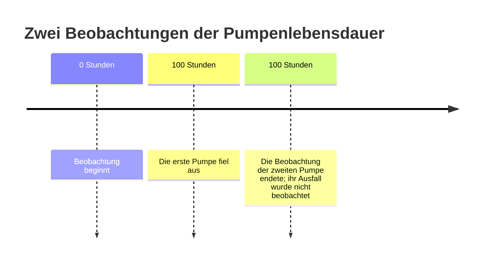

# Veridist: Funktionsleitfaden

[English](capability-guide.md) | [فارسی](capability-guide.fa.md) | [Deutsch](capability-guide.de.md)

Dieser Leitfaden beschreibt die praktische Grenze von **Veridist 1.0.1**: welche Daten das Paket annimmt, welches Ergebnis es liefert und wo die Unterstützung endet. Eine Funktion ist nur unter den genannten Daten- und Ausführungsbedingungen unterstützt.

## Ich möchte die Zeit bis zu einem Ereignis analysieren

Lebensdaueranalyse ist nicht auf Geräte beschränkt. Dieselbe Datenstruktur kann die Zeit bis zu Ausfall, Rückfall, Kreditausfall, erstem Versicherungsschaden, Kundenabwanderung, Konversion oder einem anderen klar definierten Ereignis beschreiben. Ein Datensatz ist rechtszensiert, wenn das Ereignis bis zum Beobachtungsstichtag nicht eingetreten ist.

| Bereich | Beispiel für ein exaktes Ereignis | Beispiel für Rechtszensierung |
| --- | --- | --- |
| Zuverlässigkeit und Fertigung | Ein Lager fiel nach 400 Stunden aus | Das Lager funktionierte nach 400 Stunden noch |
| Gesundheit und Überlebenszeitanalyse | Eine Wiederaufnahme erfolgte nach 30 Tagen | Bis Tag 30 war keine Wiederaufnahme erfolgt |
| Kredit und Versicherung | Ein Ausfall oder erster Schaden trat während der Nachbeobachtung ein | Bis zum Studienende trat kein Ausfall oder Schaden ein |
| Digitale Produkte | Ein Kunde wanderte ab oder konvertierte | Der Kunde blieb bis zum Stichtag ohne Ereignis aktiv |
| Betrieb | Eine Reparatur, Lieferung oder Dienstleistung wurde abgeschlossen | Der Vorgang war am Ende der Datenerhebung noch offen |

Veridist passt eine statistische Verteilung an diese beobachteten Zeiten an, wenn die aktuellen Modellannahmen und der Eingabevertrag gelten. **Exponential-MLE**, **Weibull-Minimum-MLE** und **Lognormal-MLE** sind mit fester Lage `loc=0` für exakte und unabhängige Rechtszensierung verfügbar. Der UTF-8-CSV-Workflow ist bewusst enger: Er passt das ratenbasierte Exponentialmodell aus einem dokumentierten Zweispaltenformat an.

Betrugserkennung und Cybersicherheit stellen häufig eine andere Frage: Ist ein Betrag, Zeitabstand oder eine Latenz unter einer Referenzverteilung ungewöhnlich? Veridist kann für unterstützte Familien skalare Log-Dichte, Randwahrscheinlichkeit und Quantile berechnen, wenn vertretbare Parameter bereits vorliegen. Diese Werte können Signale in einem separat validierten Detektor sein; das Paket trainiert oder betreibt keinen vollständigen Betrugsklassifikator.

| Modell | Beschriebenes Verhalten | Eingabe |
| --- | --- | --- |
| Exponential | Konstante Ausfallrate über die Zeit | Striktes CSV oder vorbereitete Python-Daten |
| Weibull-Minimum | Sinkende, konstante oder steigende Ausfallrate, abhängig von der Form | Vorbereitete Python-Daten |
| Lognormal | Positive Lebensdauern, deren Logarithmus einem Normalmodell folgt | Vorbereitete Python-Daten |

Für den Einstieg über CSV steht nur das Exponentialmodell bereit. Die Datei muss UTF-8 sein und genau die zwei Spalten `time,event_observed` in dieser Reihenfolge enthalten. Die erste Spalte ist die Beobachtungsdauer. In der zweiten bedeutet `1`, dass der Ausfall beobachtet wurde, und `0`, dass bis zum Beobachtungsende kein Ausfall gesehen wurde. Veridist errät das Dateiformat nicht.

Weibull-Minimum und Lognormal verwenden typisierte Lebensdauerobjekte. Weibull akzeptiert Häufigkeitsgewichte und optional eine feste Form; Lognormal akzeptiert Häufigkeitsgewichte. Bei Erfolg gibt es eine endliche Schätzung, andernfalls einen typisierten statistischen oder Ausführungsfehler mit Ursache. Fehler beim Lesen einer Datei werden getrennt von statistischen Fehlern gemeldet. Der Abschluss einer Berechnung beweist nicht, dass ein Modell für die Daten angemessen ist.

## Was ist, wenn einige Geräte noch nicht ausgefallen sind?

Verwenden Sie `event_observed=0`, wenn ein Gerät beim Ende der Beobachtung noch nicht ausgefallen war. Das ist unabhängige Rechtszensierung: Die endgültige Lebensdauer ist unbekannt, aber sie ist länger als die beobachtete Zeit. Das aktuelle Verfahren setzt voraus, dass das Ende der Beobachtung unabhängig von der noch nicht beobachteten Ausfallzeit ist. Pumpen wegen Anzeichen eines unmittelbar bevorstehenden Ausfalls aus einer Studie zu nehmen, kann diese Annahme verletzen; Veridist kann sie nicht aus den Daten beweisen.

Im Diagramm ist die Ausfallzeit der ersten Pumpe bekannt. Bei der zweiten wissen wir nur, dass sie mindestens 100 Stunden lief. Diese Information bleibt erhalten und fließt in den Fit ein.

Links- und Intervallzensierung sowie Trunkierung gehören nicht zum Umfang von 1.0.

## Welches Ergebnis erhalte ich?

Ein Fit enthält geschätzte Parameter, Diagnosen und die Annahmen der Berechnung. Für endliche, positive und unzensierte Exponentialstichproben unterstützt Veridist außerdem **Monte-Carlo-KS/AD/CvM mit erneuter Anpassung**, AIC/BIC, eine Kalibrierungsübersicht und eine adequacy-gesteuerte Auswahl. Gewählt wird der Kandidat mit dem kleinsten AIC, der die definierte Angemessenheitsprüfung besteht; andernfalls lautet das Ergebnis `NONE_ADEQUATE`. Dies ist keine automatische Rangfolge zwischen Exponential, Weibull und Lognormal.

## Was kann ich außer dem Fit berechnen?

Normal, Gamma, Weibull-Minimum, Lognormal und Rechts-Gumbel unterstützen skalare Log-Dichte, CDF, Überlebensfunktion, Quantile und vom Aufrufer gesteuerte Zufallsstichproben. Diese Operationen sind skalar: Es gibt keine Array-API, und eine Berechnungsfunktion bedeutet nicht automatisch, dass die Familie auch angepasst werden kann.

## Was geschieht bei großen Daten oder einer Unterbrechung?

Vom Aufrufer bereitgestellte Datenblöcke können nacheinander reduziert werden. Erfolgreiche binary64-Log-Dichtewerte verwenden einen festen O(1)-Reduktionszustand mit einer abschließenden binary64-Rundung. Das ist keine allgemeine Aussage zu RSS oder Durchsatz.

Historische Nachweise decken den strikten exponentiellen CSV-Pfad mit 10 Tausend, 100 Tausend und 1 Million Zeilen sowie mehreren Chunk-Größen ab. Sie beschreiben genau diese Läufe, nicht Geschwindigkeit oder Speicherverbrauch jedes Rechners und Datensatzes.

Für kompatible exponentielle Reduktionen kann ein lokaler SQLite-Checkpoint den Zustand nach einer Unterbrechung bewahren. Vor dem Fortsetzen prüft Veridist Quellrevision, Prüfsumme, Checkpoint-Generation und verarbeitete Bereiche. Dauerhafte Wiederaufnahme ist auf einen Host und sein lokales Dateisystem begrenzt; sie ist keine verteilte Ausführung.

## Was wird noch nicht unterstützt?

Die Version 1.0 unterstützt keine Kovariaten wie Temperatur oder Druck, analytischen Gewichte, freien Lageparameter, allgemeinen Dataframe-/Datenbankadapter, verteilte Checkpoints, Bootstrap-Stabilität der Auswahl oder Inferenz für jede registrierte Familie. Die vollständige Grenze steht unter [bekannte Grenzen](../python/KNOWN_LIMITS.de.md).

## Wie wird die Codequalität geprüft?

Ergebnisse werden mit unabhängigen Referenzen verglichen. Tests decken ungültige Eingaben, Grenzfälle, Unterbrechung und Wiederaufnahme ab und laufen auf Python 3.11 bis 3.14. Das Qualitäts-Gate verlangt mindestens 95 % globale Zeilen- und Zweigabdeckung sowie strengere Schwellen für numerische Module. Kritischer statistischer Code durchläuft zusätzlich ein fail-closed Mutation-Gate. Die Abdeckungszahl ist eine Annahmebedingung, keine Aussage über einen aktuellen Prozentsatz; Geschwindigkeits- und Speichernachweise gelten nur für die getesteten Daten, Umgebung und Revision.

Technische Details zur genaueren Prüfung

Alle drei Fit-Modelle verwenden Maximum-Likelihood-Schätzung mit fester Lage null. Exponential schätzt nur die Rate; Weibull schätzt Form und Skala; Lognormal schätzt logarithmische Lage und Skala. Häufigkeitsgewichte bedeuten wiederholte Beobachtungen und werden von Weibull und Lognormal unterstützt; sie unterscheiden sich von analytischen Gewichten. Ein numerisches Scheitern oder fehlende Konvergenz wird mit einer benannten Ursache gemeldet.

Die Exponentialauswertung berichtet angeforderte, erfolgreiche und fehlgeschlagene Neuanpassungen sowie Monte-Carlo-Unsicherheit. Sie bestimmen die Zufallszahlenfolge selbst; derselbe Seed reproduziert dasselbe Experiment. Die Stream-Anzahl hat eine explizite vorzeichenlose 64-Bit-Grenze. Tests decken Unterbrechung, Wiederholung, Beschädigung, konkurrierenden Zugriff und Abbruch ab.

Messwerte gelten nur für Adapter, Familie, Arbeitslast, Plattform, Python-Version, Chunk-Grenze und Kandidaten-SHA, die tatsächlich getestet wurden. Nicht unterstützte Kombinationen scheitern ausdrücklich. Das strikte CSV-Beispiel und gerenderte persische RTL-Seiten sind ausführbare CI-Verträge.

## Fachbegriffe

1. **Verteilungsanpassung:** Schätzung der Parameter eines Verteilungsmodells aus Daten.
2. **Rechtszensierung:** Das Ereignis wurde bis zum Beobachtungsende nicht gesehen; seine endgültige Zeit ist unbekannt.
3. **Modellangemessenheit:** Ob Annahmen und Form eines Modells für Daten und Zweck akzeptabel sind.
4. **Angemessenheitsprüfung:** Die festgelegte statistische Prüfung zur Annahme oder Ablehnung eines Kandidaten.
5. **AIC:** Vergleicht Modelle anhand Anpassungsgüte und Parameterzahl; kleiner ist nur unter den verglichenen Modellen besser.
6. **Verteilungsfamilien:** Wahrscheinlichkeitsverteilungen mit unterschiedlichen Formen und Anwendungen; derzeit mit skalaren Operationen.
7. **Log-Dichte:** Logarithmus der relativen Plausibilität einer Beobachtung unter dem Modell für numerisch stabile Berechnungen.
8. **Quantil:** Schwellenwert, unter dem ein festgelegter Anteil der Modellwahrscheinlichkeit liegt.
9. **Streaming-Reduktion:** Verarbeitung aufeinanderfolgender Datenblöcke, ohne die gesamte Eingabe im Speicher zu halten.
10. **Kompatible Exponentialberechnung:** Lauf mit demselben Quellen-, Modell- und Reduktionsvertrag, der gespeicherten Zustand fortsetzen kann.
11. **SQLite:** Kleine dateibasierte Datenbank auf demselben Rechner.
12. **Quellrevision:** Kennung, die zeigt, dass sich die Eingabe seit dem Speichern nicht geändert hat.
13. **Prüfsumme:** Aus gespeicherten Informationen berechneter Wert zur Erkennung unbeabsichtigter Änderung oder Beschädigung.
14. **Checkpoint-Generation:** Fortlaufende Version des gespeicherten Zustands, die unvereinbare gleichzeitige Aktualisierungen verhindert.
15. **Verarbeitete Bereiche:** Eingabepositionen, die bereits erfolgreich berechnet wurden.
16. **Testabdeckung:** Anteil ausführbarer Zeilen und Entscheidungspfade, die Tests ausführen.
17. **Maximum-Likelihood-Schätzung und feste Lage null:** Parameter maximieren die Datenwahrscheinlichkeit; das Modell kann nicht horizontal verschoben werden.
18. **Modellparameter:** Exponential verwendet Rate, Weibull Form und Skala, Lognormal logarithmische Lage und Skala.
19. **Häufigkeitsgewichte:** Anzahl der Wiederholungen einer Beobachtung, verschieden von analytischen Gewichten.
20. **Numerisches Scheitern:** Gleitkomma- oder Konvergenzgrenzen verhindern ein vertrauenswürdiges Ergebnis.
21. **KS/AD/CvM:** Drei Anpassungstests, die auf unterschiedliche Abweichungen zwischen Daten und Modell reagieren.
22. **BIC:** Modellvergleichskriterium, das zusätzliche Parameter stärker bestraft.
23. **Seed:** Anfangswert, mit dem dieselbe Zufallszahlenfolge reproduzierbar wird.
24. **binary64:** Übliches 64-Bit-Rechnerformat für Gleitkommazahlen.
25. **Vorzeichenlose Ganzzahlgrenze:** Größte vom Vertrag erlaubte Beobachtungszahl, ohne negative Werte in 64 Bit dargestellt.
26. **Links- und Intervallzensierung:** Ein Ereignis trat vor einem Zeitpunkt oder in einem Intervall auf, ohne genaue Zeit.
27. **Trunkierung:** Aufnahme einer Beobachtung hängt vom Überschreiten einer Bedingung oder Schwelle ab.
28. **Kovariaten:** Variablen wie Temperatur oder Druck, die mit der Lebensdauer zusammenhängen können.
29. **Analytische Gewichte:** Gewichte, die Bedeutung oder Präzision einer Beobachtung ändern, nicht ihre Wiederholungszahl.
30. **Freie Lage:** Geschätzter Parameter, der eine Verteilung entlang der Zeitachse verschiebt.
31. **Bootstrap:** Wiederholtes Ziehen aus den Daten zur Beurteilung der Ergebnisstabilität.

[Zurück zum Hauptleitfaden](../README.de.md)
