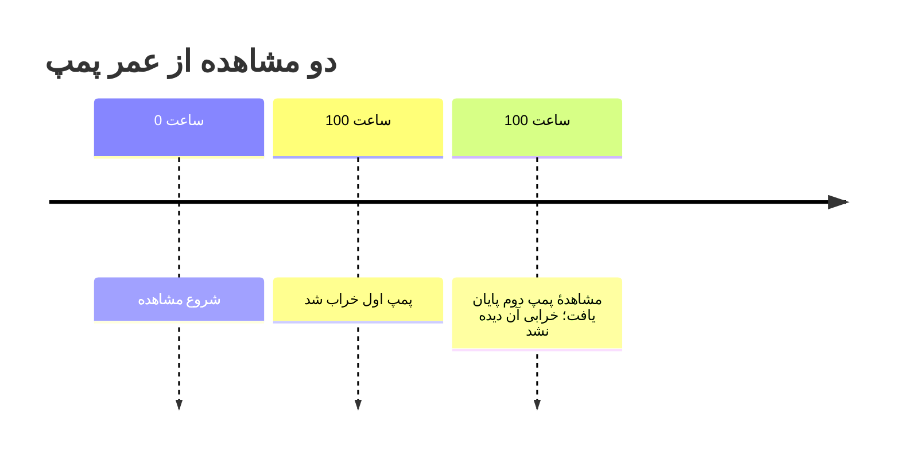

<h1 dir="rtl" align="right">با <bdi dir="ltr">Veridist</bdi> چه کارهایی می‌توانید انجام دهید؟</h1>

<a href="capability-guide.md">English</a> | <a href="capability-guide.fa.md">فارسی</a> | <a href="capability-guide.de.md">Deutsch</a>

این راهنما دربارهٔ نسخهٔ ۱٫۰٫۱ است. کمک می‌کند بدانید چه داده‌ای می‌توانید به برنامه بدهید، چه نتیجه‌ای بگیرید و چه کارهایی هنوز پشتیبانی نمی‌شوند.

<h2 dir="rtl" align="right">می‌خواهم زمان تا وقوع یک رویداد را بررسی کنم</h2>

تحلیل طول عمر فقط برای دستگاه نیست. همین ساختار داده می‌تواند زمان تا خرابی، عود بیماری، نکول، نخستین خسارت بیمه، ریزش مشتری، تبدیل یا هر رویداد روشن دیگری را توصیف کند. اگر رویداد تا پایان بازهٔ مشاهده رخ نداده باشد، آن مشاهده سانسورشده از راست است.

| حوزه | نمونهٔ رخداد دقیق | نمونهٔ مشاهدهٔ سانسورشده از راست |
| --- | --- | --- |
| قابلیت اطمینان و تولید | یاتاقان پس از ۴۰۰ ساعت خراب شد | یاتاقان پس از ۴۰۰ ساعت هنوز کار می‌کرد |
| سلامت و پژوهش بقا | بیمار پس از ۳۰ روز دوباره بستری شد | تا روز سی‌ام بستری دوباره رخ نداد |
| اعتبار و بیمه | نکول یا نخستین خسارت در دورهٔ پیگیری رخ داد | تا پایان بررسی نکول یا خسارتی ثبت نشد |
| محصول دیجیتال | مشتری ریزش کرد یا تبدیل انجام شد | مشتری تا پایان بازه فعال ماند و رویداد رخ نداد |
| عملیات | تعمیر، تحویل یا خدمت کامل شد | فرایند هنگام پایان جمع‌آوری داده هنوز باز بود |

<bdi dir="ltr">Veridist</bdi> زمانی می‌تواند یک توزیع آماری را به این زمان‌ها <strong>برازش</strong><a href="#fn-fitting">۱</a> دهد که فرض‌های مدل و قرارداد ورودی فعلی برقرار باشند. مدل‌های نمایی، وایبول کمینه و لگ‌نرمال با مکان ثابت صفر، برای رخدادهای دقیق و سانسور مستقل از راست در دسترس‌اند. مسیر فایل <bdi dir="ltr">CSV</bdi> محدودتر است: فقط مدل نماییِ نرخ‌محور را از قالب دو ستونیِ مشخص برازش می‌دهد.

در کشف تقلب و امنیت سایبری معمولاً پرسش کمی متفاوت است: آیا یک مبلغ، فاصلهٔ زمانی یا زمان پاسخ در مقایسه با توزیع مرجع غیرعادی است؟ اگر پارامترهای قابل‌دفاع از قبل موجود باشند، <bdi dir="ltr">Veridist</bdi> می‌تواند برای خانواده‌های پشتیبانی‌شده لگاریتم چگالی، احتمال دنباله و صدک را محاسبه کند. این مقادیر می‌توانند ورودی یک سامانهٔ تشخیص جداگانه و اعتبارسنجی‌شده باشند؛ خود بسته سامانهٔ کامل تشخیص تقلب را آموزش یا اجرا نمی‌کند.

| مدل | چه رفتاری را توصیف می‌کند؟ | ورودی |
| --- | --- | --- |
| نمایی | نرخ خرابی ثابت در طول زمان | فایل CSV با قالب مشخص یا دادهٔ آماده‌شده در پایتون |
| وایبول کمینه | نرخ خرابی کاهشی، ثابت یا افزایشی، بسته به پارامتر شکل | دادهٔ آماده‌شده در پایتون |
| لگ‌نرمال | زمان‌های مثبت که لگاریتم آن‌ها از مدل نرمال پیروی می‌کند | دادهٔ آماده‌شده در پایتون |

برای شروع با فایل CSV، فعلاً فقط مدل نمایی در دسترس است. فایل باید با کدگذاری <bdi dir="ltr">UTF-8</bdi> ذخیره شود و دقیقاً دو ستون <code dir="ltr">time,event_observed</code> به همین ترتیب داشته باشد. ستون اول مدت مشاهده است. در ستون دوم، عدد ۱ یعنی خرابی دیده شده و عدد ۰ یعنی تا پایان مشاهده خرابی دیده نشده است. برنامه قالب فایل را حدس نمی‌زند.

<h2 dir="rtl" align="right">اگر بعضی دستگاه‌ها هنوز خراب نشده باشند چه؟</h2>

اطلاعات آن‌ها هم قابل استفاده است. مثلاً اگر پمپی پس از ۱۰۰ ساعت هنوز کار می‌کند، می‌دانیم عمر آن بیشتر از ۱۰۰ ساعت بوده؛ حتی اگر زمان خرابی نهایی را ندانیم. این مشاهده را <strong>دادهٔ سانسورشده از راست</strong><a href="#fn-censoring">۲</a> می‌نامیم. هر سه مدل بالا این داده را می‌پذیرند.

روش فعلی فرض می‌کند پایان مشاهده به زمان خرابیِ هنوز مشاهده‌نشده وابسته نیست. مثلاً خارج‌کردن پمپ‌ها از مطالعه به‌دلیل نشانه‌های خرابی قریب‌الوقوع می‌تواند این فرض را نقض کند. برنامه نمی‌تواند درست‌بودن این فرض را از روی داده اثبات کند.

در نمودار، زمان خرابی پمپ اول معلوم است. دربارهٔ پمپ دوم فقط می‌دانیم دست‌کم ۱۰۰ ساعت کار کرده است. این اطلاعات حذف نمی‌شود و در برازش وارد می‌شود.

<h2 dir="rtl" align="right">چه نتیجه‌ای می‌گیرم؟</h2>

اگر برآورد ممکن باشد، پارامترهای مدل و اطلاعات محاسبه را دریافت می‌کنید. اگر برآورد ممکن نباشد، علت مشخص می‌شود؛ مثلاً نبود هیچ خرابیِ مشاهده‌شده. مشکل خواندن فایل هم جدا از مشکل آماری گزارش می‌شود. تمام‌شدن محاسبه به‌تنهایی به معنای <strong>مناسب‌بودن مدل</strong><a href="#fn-model-adequacy">۳</a> برای دادهٔ شما نیست.

ابزار بررسی مناسب‌بودن مدل فعلاً فقط برای نمونه‌های نماییِ مثبت، متناهی و بدون سانسور در دسترس است. در مسیر انتخاب، از بین گزینه‌هایی که <strong>بررسی کفایت</strong><a href="#fn-adequacy-check">۴</a> را گذرانده‌اند، گزینهٔ دارای کمترین معیار <bdi dir="ltr">AIC</bdi><a href="#fn-aic">۵</a> انتخاب می‌شود. این معیار هم کیفیت توضیح‌دادن داده و هم تعداد پارامترهای مدل را در نظر می‌گیرد؛ مقدار کمتر، فقط در میان مدل‌های بررسی‌شده، ترجیح دارد. اگر هیچ گزینه‌ای مناسب نباشد، نتیجهٔ <code dir="ltr">NONE_ADEQUATE</code> برمی‌گردد. این قابلیت، رتبه‌بندی خودکار بین نمایی، وایبول و لگ‌نرمال نیست.

<h2 dir="rtl" align="right">به‌جز برازش، چه محاسباتی ممکن است؟</h2>

برای توزیع‌های <strong>نرمال، گاما، وایبول کمینه، لگ‌نرمال و گامبل راست</strong><a href="#fn-families">۶</a> می‌توانید <strong>لگاریتم چگالی</strong><a href="#fn-log-density">۷</a>، احتمال کمتر یا بیشتر بودن مقدار از یک حد، چندک‌ها<a href="#fn-quantile">۸</a> و نمونه‌های تصادفی را محاسبه کنید. مثلاً چندک ۹۵٪ مقداری است که طبق مدل، ۹۵٪ داده‌ها پایین‌تر از آن قرار می‌گیرند.

این ابزارها فعلاً هر بار یک مقدار عددی می‌پذیرند، نه یک آرایه. وجود ابزار محاسبه برای یک توزیع، به معنای وجود ابزار برازش آن نیست. برای نمونه‌گیری نیز مولد اعداد تصادفی را خودتان به برنامه می‌دهید.

<h2 dir="rtl" align="right">اگر داده زیاد باشد یا برنامه قطع شود چه؟</h2>

در مسیرهای پشتیبانی‌شده می‌توانید داده را بخش‌به‌بخش وارد محاسبه کنید؛ یعنی هر بخش خوانده، به نتیجه افزوده و سپس از حافظه رها می‌شود. به این شیوه <strong>جمع جریانی</strong><a href="#fn-streaming">۹</a> می‌گوییم. فضای لازم برای نگهداری مجموعِ لگاریتم درست‌نمایی با زیادشدن تعداد داده‌ها رشد نمی‌کند. این ویژگی به‌تنهایی سقف حافظهٔ کل برنامه یا سرعت مشخصی را روی هر کامپیوتر تضمین نمی‌کند.

شواهد تاریخی این مسیر CSV نمایی روی ۱۰هزار، ۱۰۰هزار و یک‌میلیون ردیف و چند اندازهٔ بخش ثبت شده‌اند. این شواهد نشان می‌دهند که آن آزمایش‌ها کامل شده‌اند، اما تضمین سرعت یا حافظه برای رایانه و دادهٔ شما نیستند.

برای <strong>محاسبات نماییِ سازگار</strong><a href="#fn-compatible-exponential">۱۰</a>، از جمله مسیر CSV مربوط به ادامهٔ اجرا، پیشرفت محاسبه در یک فایل محلی <bdi dir="ltr">SQLite</bdi><a href="#fn-sqlite">۱۱</a> ذخیره می‌شود و پس از وقفه قابل ادامه است. پیش از ادامه، برنامه <strong>نسخهٔ منبع</strong><a href="#fn-source-revision">۱۲</a>، <strong>جمع کنترلی</strong><a href="#fn-checksum">۱۳</a>، <strong>نسل وضعیت</strong><a href="#fn-generation">۱۴</a> و <strong>بازه‌های پردازش‌شده</strong><a href="#fn-ranges">۱۵</a> را بررسی می‌کند. این قابلیت روی یک کامپیوتر و فایل‌سیستم محلی کار می‌کند.

<h2 dir="rtl" align="right">چه کارهایی هنوز پشتیبانی نمی‌شوند؟</h2>

روش فعلی داده‌هایی را که فقط زمان تقریبی رویداد در یک بازه یا پیش از یک زمان مشخص معلوم است نمی‌پذیرد. مدل‌کردن اثر عواملی مثل دما و فشار بر عمر، اتصال عمومی به دیتافریم و پایگاه داده و ذخیرهٔ پیشرفت بین چند کامپیوتر هم در دسترس نیست. جزئیات فنی این موارد در بخش بازشوندهٔ پایین و فهرست کامل و راست‌چین آن‌ها در <a href="../python/KNOWN_LIMITS.fa.md">محدودیت‌های شناخته‌شده</a> آمده است.

<h2 dir="rtl" align="right">کیفیت کد ما چگونه بررسی می‌شود؟</h2>

نتایج با محاسبات مرجع مستقل مقایسه می‌شوند. آزمون‌ها دادهٔ نامعتبر، حالت‌های مرزی و قطع و ادامهٔ اجرا را نیز بررسی می‌کنند. این نسخه روی پایتون ۳٫۱۱ تا ۳٫۱۴ آزموده می‌شود.

<strong>پوشش آزمون</strong><a href="#fn-coverage">۱۶</a> باید دست‌کم ۹۵٪ باشد؛ یعنی آزمون‌ها باید دست‌کم ۹۵٪ از خط‌های قابل اجرا و ۹۵٪ از مسیرهای تصمیم‌گیریِ کد را اجرا کنند. بخش‌های عددی معیار سخت‌گیرانه‌تری دارند. این عدد شرط پذیرش است، نه گزارش درصد فعلی. در هستهٔ آماری، خطاهایی عمداً وارد کد می‌شوند تا مشخص شود آزمون‌ها آن‌ها را تشخیص می‌دهند یا نه. نتیجهٔ سنجش سرعت و حافظه نیز فقط برای همان داده، محیط و نسخهٔ آزمایش‌شده معتبر است.

جزئیات فنی برای بررسی دقیق‌تر

هر سه مدل با <strong>بیشینه‌سازی درست‌نمایی و مکان ثابت صفر</strong><a href="#fn-mle-location">۱۷</a> برازش می‌شوند. <strong>در نمایی فقط نرخ، در وایبول شکل و مقیاس و در لگ‌نرمال مکان و مقیاس لگاریتمی</strong><a href="#fn-parameters">۱۸</a> برآورد می‌شود. <strong>وایبول و لگ‌نرمال وزن فراوانی می‌پذیرند</strong><a href="#fn-frequency-weights">۱۹</a>؛ یعنی وزن، تعداد تکرار مشاهده را نشان می‌دهد. در وایبول می‌توان شکل را از پیش ثابت کرد. <strong>شکست عددی</strong><a href="#fn-numerical-failure">۲۰</a> یا نرسیدن روش برازش به جواب، با علت مشخص گزارش می‌شود.

ارزیابی نمایی شامل آزمون‌های <bdi dir="ltr">KS/AD/CvM</bdi><a href="#fn-gof-tests">۲۱</a> با شبیه‌سازی مونت‌کارلو و برازش مجدد، معیارهای <bdi dir="ltr">AIC/BIC</bdi><a href="#fn-bic">۲۲</a> و خلاصهٔ کالیبراسیون است. شمار برازش‌های مجدد درخواستی، موفق و ناموفق و عدم‌قطعیت مونت‌کارلو گزارش می‌شود. برای اینکه آزمایش قابل تکرار باشد، شما دنبالهٔ اعداد تصادفی را انتخاب می‌کنید؛ مثلاً با یک <bdi dir="ltr">seed</bdi><a href="#fn-seed">۲۳</a> مشخص می‌توانید همان آزمایش را دوباره اجرا کنید.

در جمع جریانی، عددهای حاصل از هر بخش با <strong>قالب عدد اعشاری رایانه</strong><a href="#fn-binary64">۲۴</a>، یعنی <bdi dir="ltr">binary64</bdi>، جمع می‌شوند و مجموع فقط یک بار در پایان گرد می‌شود. شمار مشاهدات <strong>سقف صریح عدد صحیح</strong><a href="#fn-unsigned-limit">۲۵</a> بدون علامت ۶۴بیتی دارد. آزمون‌ها وقفه، اجرای مجدد، خرابی اطلاعات، رقابت دسترسی و لغو را پوشش می‌دهند.

<strong>سانسور چپ و فاصله‌ای</strong><a href="#fn-left-interval">۲۶</a>، <strong>برش داده</strong><a href="#fn-truncation">۲۷</a>، <strong>متغیرهای کمکی</strong><a href="#fn-covariates">۲۸</a>، <strong>وزن تحلیلی</strong><a href="#fn-analytic-weights">۲۹</a>، <strong>پارامتر مکان آزاد</strong><a href="#fn-free-location">۳۰</a>، API آرایه‌ای، ذخیرهٔ وضعیت توزیع‌شده، آداپتور عمومی دیتافریم یا پایگاه داده، پایداری انتخاب با <strong>بوت‌استرپ</strong><a href="#fn-bootstrap">۳۱</a> و استنباط برای تمام خانواده‌ها پشتیبانی نمی‌شوند. شواهد انتشار و مقیاس به شناسهٔ کامل کامیت متصل‌اند. نمونهٔ CSV و گزارش‌های فارسی نیز در آزمون‌های خودکار بررسی می‌شوند.

<h2 dir="rtl" align="right">پانویس اصطلاحات</h2>

<strong>۱.</strong> <bdi dir="ltr">Distribution Fitting</bdi> — برآورد پارامترهای یک مدل توزیع از روی داده. <a href="#fnref-fitting">↩</a>

<strong>۲.</strong> <bdi dir="ltr">Right Censoring</bdi> — رویداد تا پایان مشاهده دیده نشده و زمان نهایی آن معلوم نیست. <a href="#fnref-censoring">↩</a>

<strong>۵.</strong> <bdi dir="ltr">Akaike Information Criterion (AIC)</bdi> — معیار مقایسهٔ مدل‌ها که کیفیت برازش و تعداد پارامترها را با هم می‌سنجد. مقدار کمتر فقط در میان مدل‌های بررسی‌شده ترجیح دارد. <a href="#fnref-aic">↩</a>

<strong>۸.</strong> <bdi dir="ltr">Quantile</bdi> — آستانه‌ای که سهم معینی از داده‌ها یا احتمال مدل پایین‌تر از آن قرار می‌گیرد. <a href="#fnref-quantile">↩</a>

<strong>۹.</strong> <bdi dir="ltr">Streaming reduction</bdi> — پردازش پیاپی بخش‌های داده، بدون نگه‌داشتن تمام داده در حافظه. <a href="#fnref-streaming">↩</a>

<strong>۱۱.</strong> <bdi dir="ltr">SQLite</bdi> — پایگاه دادهٔ کوچکِ فایل‌محور که در همان رایانه نگه‌داری می‌شود. <a href="#fnref-sqlite">↩</a>

<strong>۱۲.</strong> <bdi dir="ltr">Source revision</bdi> — شناسه‌ای که نشان می‌دهد دادهٔ ورودی از زمان ذخیرهٔ وضعیت تغییر نکرده است. <a href="#fnref-source-revision">↩</a>

<strong>۱۳.</strong> <bdi dir="ltr">Checksum</bdi> — عددی محاسبه‌شده از اطلاعات ذخیره‌شده که تغییر یا خرابی ناخواستهٔ آن را آشکار می‌کند. <a href="#fnref-checksum">↩</a>

<strong>۱۴.</strong> <bdi dir="ltr">Checkpoint generation</bdi> — شمارهٔ نسخهٔ متوالیِ وضعیت ذخیره‌شده؛ برای جلوگیری از ثبت هم‌زمان و ناسازگار دو ادامهٔ اجرا به کار می‌رود. <a href="#fnref-generation">↩</a>

<strong>۱۵.</strong> <bdi dir="ltr">Processed ranges</bdi> — بخش‌هایی از ترتیب داده که پیش‌تر با موفقیت محاسبه شده‌اند. <a href="#fnref-ranges">↩</a>

<strong>۱۶.</strong> <bdi dir="ltr">Test coverage</bdi> — نسبت خط‌ها و مسیرهای تصمیم‌گیریِ کد که هنگام اجرای آزمون‌ها واقعاً اجرا می‌شوند. <a href="#fnref-coverage">↩</a>

<strong>۲۴.</strong> <bdi dir="ltr">binary64</bdi> — قالب معمول ۶۴بیتی برای نگه‌داری عددهای اعشاری در رایانه. <a href="#fnref-binary64">↩</a>

<strong>۳.</strong> <bdi dir="ltr">Model adequacy</bdi> — اینکه فرض‌ها و شکل مدل برای داده و هدف تحلیل شما پذیرفتنی باشند. <a href="#fnref-model-adequacy">↩</a>

<strong>۴.</strong> <bdi dir="ltr">Adequacy check</bdi> — بررسی آماریِ تعریف‌شده در این مسیر برای رد یا نپذیرفتن یک مدل نامزد. <a href="#fnref-adequacy-check">↩</a>

<strong>۶.</strong> خانواده‌های توزیع احتمال با شکل‌ها و کاربردهای متفاوت؛ این فهرست فقط عملیات اسکالر دارد. <a href="#fnref-families">↩</a>

<strong>۷.</strong> <bdi dir="ltr">Log density</bdi> — لگاریتم احتمال‌پذیری نسبی یک مشاهده زیر مدل؛ برای محاسبات پایدار عددی به کار می‌رود. <a href="#fnref-log-density">↩</a>

<strong>۱۰.</strong> اجرای نمایی با قرارداد یکسانِ منبع، مدل و روش تجمیع؛ فقط چنین اجرایی می‌تواند از وضعیت ذخیره‌شده ادامه یابد. <a href="#fnref-compatible-exponential">↩</a>

<strong>۱۷.</strong> <bdi dir="ltr">Maximum likelihood estimation</bdi> پارامترهایی را انتخاب می‌کند که دادهٔ مشاهده‌شده را زیر مدل محتمل‌تر می‌کنند. مکان ثابت صفر یعنی مدل اجازهٔ جابه‌جایی افقیِ توزیع را نمی‌دهد. <a href="#fnref-mle-location">↩</a>

<strong>۱۸.</strong> نرخ در نمایی سرعت رخداد است؛ شکل و مقیاس در وایبول روند و واحد زمانی را کنترل می‌کنند؛ پارامترهای لگ‌نرمال روی لگاریتم زمان کار می‌کنند. <a href="#fnref-parameters">↩</a>

<strong>۱۹.</strong> <bdi dir="ltr">Frequency weights</bdi> یعنی هر مشاهده به تعداد مشخصی تکرار شده است؛ این با وزن تحلیلی متفاوت است. <a href="#fnref-frequency-weights">↩</a>

<strong>۲۰.</strong> <bdi dir="ltr">Numerical failure</bdi> — محدودیت محاسبات اعشاری یا همگرایی باعث می‌شود نتیجهٔ قابل‌اعتماد تولید نشود. <a href="#fnref-numerical-failure">↩</a>

<strong>۲۱.</strong> <bdi dir="ltr">KS/AD/CvM</bdi> — سه آزمون برای سنجش فاصلهٔ داده از توزیع مدل‌شده؛ هرکدام به بخش متفاوتی از تفاوت‌ها حساس‌اند. <a href="#fnref-gof-tests">↩</a>

<strong>۲۲.</strong> <bdi dir="ltr">BIC</bdi> — معیار مقایسهٔ مدل‌ها که برای مدل‌های دارای پارامترهای بیشتر جریمهٔ بیشتری در نظر می‌گیرد. <a href="#fnref-bic">↩</a>

<strong>۲۳.</strong> <bdi dir="ltr">Seed</bdi> — مقدار آغازینِ تولید اعداد تصادفی که تکرار همان دنباله را ممکن می‌کند. <a href="#fnref-seed">↩</a>

<strong>۲۵.</strong> بیشترین تعداد مشاهده‌ای که این قرارداد می‌پذیرد؛ از عدد منفی استفاده نمی‌شود و حد آن با ۶۴ بیت مشخص شده است. <a href="#fnref-unsigned-limit">↩</a>

<strong>۲۶.</strong> سانسور چپ یعنی رویداد پیش از یک زمان رخ داده، و سانسور فاصله‌ای یعنی رویداد در بازه‌ای رخ داده است، بدون زمان دقیق. <a href="#fnref-left-interval">↩</a>

<strong>۲۷.</strong> <bdi dir="ltr">Truncation</bdi> — ورود مشاهده به داده به عبور از یک شرط یا حد وابسته بوده است. <a href="#fnref-truncation">↩</a>

<strong>۲۸.</strong> <bdi dir="ltr">Covariates</bdi> — متغیرهایی مانند دما یا فشار که ممکن است با عمر ارتباط داشته باشند. <a href="#fnref-covariates">↩</a>

<strong>۲۹.</strong> وزن‌هایی که اهمیت یا دقت مشاهده‌ها را تغییر می‌دهند، نه تعداد تکرار آن‌ها. <a href="#fnref-analytic-weights">↩</a>

<strong>۳۰.</strong> پارامتر مکان قابل برآورد که توزیع را روی محور زمان جابه‌جا می‌کند. <a href="#fnref-free-location">↩</a>

<strong>۳۱.</strong> <bdi dir="ltr">Bootstrap</bdi> — نمونه‌گیری تکراری از داده برای سنجش پایداری یک نتیجه. <a href="#fnref-bootstrap">↩</a>

<a href="../README.fa.md">بازگشت به راهنمای اصلی</a>

