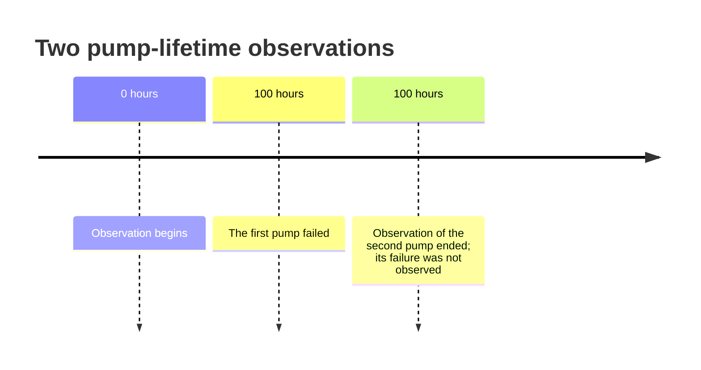

# Veridist capability guide

[English](capability-guide.md) | [فارسی](capability-guide.fa.md) | [Deutsch](capability-guide.de.md)

This guide is the practical boundary of **Veridist 1.0.1**: what you can give the package, what it returns, and where its support ends. A supported feature is supported only under the stated data and execution conditions.

## I want to analyse the lifetime of equipment

Veridist fits a statistical distribution to observed lifetimes. **Exponential MLE**, **Weibull-minimum MLE**, and **Lognormal MLE** are available with fixed `loc=0` for exact and independent right-censoring. The strict UTF-8 CSV workflow is deliberately narrower: it fits the rate-only Exponential model.

| Model | Behaviour described | Input |
| --- | --- | --- |
| Exponential | A constant failure rate over time | Strict CSV or prepared Python data |
| Weibull-minimum | A decreasing, constant, or increasing failure rate, depending on shape | Prepared Python data |
| Lognormal | Positive lifetimes whose logarithm follows a Normal model | Prepared Python data |

For a CSV start, only the Exponential model is available. The file must be UTF-8 and contain exactly the two columns `time,event_observed`, in that order. The first column is the observation duration. In the second, `1` means that failure was observed and `0` means that no failure was observed by the end of observation. Veridist does not guess the file format.

Weibull-minimum and Lognormal use typed lifetime objects. Weibull can accept frequency weights and an optional fixed shape; Lognormal can accept frequency weights. A finite estimate is returned on success, otherwise a typed statistical or execution failure explains why fitting did not finish. File-reading failures are reported separately from statistical failures. Completing a calculation alone does not establish that a model is adequate for the data.

## What if some equipment has not failed yet?

Use `event_observed=0` for an item that had not failed when observation ended. This is independent right-censoring: the final lifetime is unknown, but it is known to exceed the recorded time. The current method assumes that the end of observation is independent of the unobserved failure time. Removing pumps from a study because they show signs of imminent failure can violate that assumption; Veridist cannot prove the assumption from the data.

In the diagram, the first pump's failure time is known. For the second, we only know that it worked for at least 100 hours. That information is retained and used in fitting.

Left censoring, interval censoring, and truncation are outside the 1.0 scope.

## What result do I get?

A fit includes estimated parameters, diagnostics, and the assumptions used for the calculation. For finite, positive, uncensored Exponential samples, Veridist also supports **Refit Monte Carlo KS/AD/CvM**, AIC/BIC, a calibration summary, and adequacy-gated selection. It selects the lowest-AIC candidate that passes the configured adequacy check; otherwise it returns `NONE_ADEQUATE`. This is not automatic ranking across Exponential, Weibull, and Lognormal.

## What can I calculate besides fitting?

Normal, Gamma, Weibull-minimum, Lognormal, and right-Gumbel support scalar log-density, CDF, survival, quantile, and caller-owned random sampling. These are scalar operations: they are not an array API, and availability of a calculation does not mean that the family has a fitting API.

## What if the input is large or a run is interrupted?

Caller-owned chunks can be reduced sequentially. Successful binary64 log-density terms use a fixed O(1) reducer state, with one final binary64 rounding. There is no generic RSS or throughput claim.

Historical evidence covers the strict exponential CSV path at 10 thousand, 100 thousand, and 1 million rows with several chunk sizes. It documents those exact runs, not the speed or memory use of every machine and dataset.

For compatible exponential reductions, a local SQLite checkpoint can preserve state after interruption. Before resuming, Veridist checks source revision, checksum, checkpoint generation, and processed ranges. Durable resume is limited to one host and its local filesystem; it is not distributed execution.

## What is not supported yet?

The 1.0 release does not support covariates such as temperature or pressure, analytic weights, free location parameters, generic dataframe/database adapters, distributed checkpoints, bootstrap selection stability, or inference for every registered family. See [known limits](../python/KNOWN_LIMITS.md) for the complete release boundary.

## How is code quality checked?

Results are compared with independent references. Tests cover invalid input, boundary cases, interruption and resumption, and run on Python 3.11 through 3.14. The quality gate requires at least 95% global line and branch coverage, with stricter thresholds for numerical modules. Critical statistical code also has a fail-closed mutation gate. The coverage number is an acceptance requirement, not a claim about a current percentage; speed and memory evidence is valid only for the tested data, environment, and revision.

## Technical details

All three fitting models use maximum-likelihood estimation with fixed location zero. Exponential estimates rate only; Weibull estimates shape and scale; Lognormal estimates log-location and log-scale. Frequency weights mean repeated observations and are supported by Weibull and Lognormal; they are distinct from analytic weights. A numerical failure or lack of convergence is reported with a stated reason.

The Exponential evaluation reports requested, successful, and failed refits plus Monte Carlo uncertainty. You supply the random-number sequence; using the same seed reproduces the same experiment. The stream count has an explicit unsigned 64-bit limit. Tests cover interruption, replay, corruption, concurrent access, and cancellation.

Measurements are valid only for the exact adapter, family, workload, platform, Python version, chunk limit, and candidate SHA that were tested. Unsupported combinations fail explicitly. The strict CSV example and rendered Persian RTL pages are executable CI contracts.

[Back to the main guide](../README.md)
