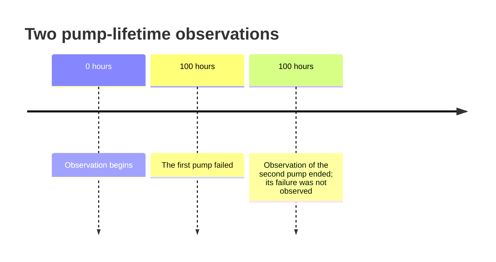

# Veridist capability guide

[English](capability-guide.md) | [فارسی](capability-guide.fa.md) | [Deutsch](capability-guide.de.md)

This guide is the practical boundary of **Veridist 2.1.0**: what you can give the package, what it returns, and where its support ends. A supported feature is supported only under the stated data and execution conditions.

## I want to analyse time until an event

Lifetime analysis is not limited to equipment. The same data structure can describe time until failure, relapse, default, a first insurance claim, customer churn, conversion, or another clearly defined event. A record is right-censored when the event has not happened by the observation cutoff.

| Field | Exact event example | Right-censored example |
| --- | --- | --- |
| Reliability and manufacturing | A bearing failed after 400 hours | A bearing was still operating after 400 hours |
| Health and survival research | Readmission occurred after 30 days | No readmission had occurred by day 30 |
| Credit and insurance | Default or a first claim occurred during follow-up | No default or claim had occurred by the study end |
| Digital products | A customer churned or converted | The customer remained active without the event at the cutoff |
| Operations | A repair, delivery, or service process completed | The process was still open when data collection ended |

Veridist fits a statistical distribution to these observed times when the current model assumptions and input contract apply. **Exponential MLE**, **Weibull-minimum MLE**, **Lognormal MLE**, **Gamma MLE**, **Normal MLE**, and **Right-Gumbel MLE** are available for exact and independent right-censoring (the four lifetime families use fixed `loc=0`). The UTF-8 CSV workflow is deliberately narrower: it fits the rate-only Exponential model from a documented two-column format.

Fraud detection and cybersecurity often ask a different question: whether an amount, time gap, or latency is unusual under a reference distribution. Veridist can supply scalar log density, tail probability, and quantile calculations for supported families when defensible parameters are already available. Those values can be signals in a separately validated detector; the package does not train or operate an end-to-end fraud classifier.

| Model | Behaviour described | Input |
| --- | --- | --- |
| Exponential | A constant failure rate over time | Strict CSV or prepared Python data |
| Weibull-minimum | A decreasing, constant, or increasing failure rate, depending on shape | Prepared Python data |
| Lognormal | Positive lifetimes whose logarithm follows a Normal model | Prepared Python data |
| Gamma | Positive lifetimes with a flexible, right-skewed shape | Prepared Python data |
| Normal | Real-valued measurements around a mean | Prepared Python data |
| Right-Gumbel | Real-valued maxima and other extreme measurements | Prepared Python data |

For a CSV start, only the Exponential model is available. The file must be UTF-8 and contain exactly the two columns `time,event_observed`, in that order. The first column is the observation duration. In the second, `1` means that failure was observed and `0` means that no failure was observed by the end of observation. Veridist does not guess the file format.

The other families use typed observation objects held in memory: `ExactLifetime` and `RightCensoredLifetime` for the lifetime families, `ExactValue` and `RightCensoredValue` for Normal and right-Gumbel; `fit(family, observations)` or the per-family function fits them, and `lifetimes_from_arrays` and `values_from_arrays` build them from array columns. Every family can accept frequency weights, and Weibull also accepts an optional fixed shape. A finite estimate is returned on success, otherwise a typed statistical or execution failure explains why fitting did not finish. File-reading failures are reported separately from statistical failures. Completing a calculation alone does not establish that a model is adequate for the data.

## What if some equipment has not failed yet?

Use `event_observed=0` for an item that had not failed when observation ended. This is independent right-censoring: the final lifetime is unknown, but it is known to exceed the recorded time. The current method assumes that the end of observation is independent of the unobserved failure time. Removing pumps from a study because they show signs of imminent failure can violate that assumption; Veridist cannot prove the assumption from the data.

```mermaid
timeline
    title Two pump-lifetime observations
    0 hours : Observation begins
    100 hours : The first pump failed
    100 hours : Observation of the second pump ended; its failure was not observed
```

In the diagram, the first pump's failure time is known. For the second, we only know that it worked for at least 100 hours. That information is retained and used in fitting.

Left censoring, interval censoring, and truncation are outside the current scope.

## What result do I get?

A fit includes estimated parameters, diagnostics, and the assumptions used for the calculation. For finite, uncensored samples, Veridist also supports **Refit Monte Carlo KS/AD/CvM** for each of the six families, AIC/BIC, a calibration summary, and adequacy-gated selection across families (`assess_families`). It selects the lowest-AIC candidate that passes the configured adequacy check; otherwise it returns `NONE_ADEQUATE`. A candidate that passes has not been rejected, which does not make it the true model, and a family whose observed fit fails is listed with its failure code and never receives a p-value. This is not a ranking of distributions beyond the families compared.

Every successful fit can also report the uncertainty of its estimate with `result.uncertainty()`: standard errors and covariance, Wald, profile-likelihood and (for uncensored exponential data) exact confidence intervals, and the mean, quantiles (B-lives) and survival probability with intervals. These are large-sample results that assume independent right censoring; when the information matrix is singular, or a Weibull shape was fixed, the result is an `UncertaintyUnavailable` value with a reason instead of numbers.

## What can I calculate besides fitting?

All six families (Exponential, Normal, Gamma, Weibull-minimum, Lognormal, and right-Gumbel) support log-density (`logpdf`), CDF, survival, quantile (`ppf`), and caller-owned random sampling through one calling form, on scalars and on numpy arrays. Arrays are broadcast; the normal, lognormal, and gamma families evaluate element by element, so they are slow on very large arrays. Right-censored likelihood terms can be reduced chunk by chunk with `reduce_lifetime_log_likelihood_chunks` and `reduce_value_log_likelihood_chunks`.

## What if the input is large or a run is interrupted?

Caller-owned chunks can be reduced sequentially. Successful binary64 log-density terms use a fixed O(1) reducer state, with one final binary64 rounding. There is no generic RSS or throughput claim.

Retained evidence covers the strict exponential CSV path at 10 thousand, 100 thousand, and 1 million rows with several chunk sizes, measured on Linux and Windows runners on 2026-10-09. It documents those exact runs, not the speed or memory use of every machine and dataset.

For compatible exponential reductions, a local SQLite checkpoint can preserve state after interruption. Before resuming, Veridist checks source revision, checksum, checkpoint generation, and processed ranges. Durable resume is limited to one host and its local filesystem; it is not distributed execution.

That resume check is separate from a plainer guard made within a single CSV read: Veridist compares the file's operating-system identity -- device, inode, size, and last-modified time -- immediately before and after that read. This catches many accidental changes but is not a content hash, so an in-place rewrite that happens to preserve all four values is not detected.

## What is not supported yet?

The current release does not support covariates such as temperature or pressure, analytic weights, free location parameters, generic dataframe/database adapters, distributed checkpoints, bootstrap selection stability, or goodness-of-fit tests and model selection for censored observations. See [known limits](../python/KNOWN_LIMITS.md) for the complete release boundary, and the [migration guide](../python/docs/migration-2.0.md) when moving from version 1.0.

## How is code quality checked?

Results are compared with independent references. Tests cover invalid input, boundary cases, interruption and resumption, and run on Python 3.11 through 3.14. The quality gate requires at least 95% global line and branch coverage, with stricter thresholds for numerical modules. Critical statistical code also has a fail-closed mutation gate. The coverage number is an acceptance requirement, not a claim about a current percentage; speed and memory evidence is valid only for the tested data, environment, and revision.

Technical details for closer review

All six fitting models use maximum-likelihood estimation; the four lifetime models use fixed location zero, while Normal and right-Gumbel estimate their location. Exponential estimates rate only; Weibull and Gamma estimate shape and scale; Lognormal estimates log-location and log-scale; Normal estimates mean and standard deviation; right-Gumbel estimates location and scale. Frequency weights mean repeated observations and are supported by every family; they are distinct from analytic weights. A numerical failure is reported as `OPTIMIZER_EXHAUSTED`; a result that only exists at the edge of the allowed search range is reported as `BOUNDARY_SOLUTION` instead of a converged estimate, and a sample for which no maximum-likelihood estimate exists (for example, every observed exact time identical) is reported as `DEGENERATE_SAMPLE`.

The goodness-of-fit evaluation of each family reports requested, successful, and failed refits plus Monte Carlo uncertainty. A refit that fails is counted, not retried, and a failed fit of the observed sample ends the evaluation with its failure code instead of a p-value. You supply the random-number sequence; using the same seed reproduces the same experiment. The cost is the number of replicates times the cost of one fit, and the calibration evidence is a seeded simulation on a declared grid only. The stream count has an explicit unsigned 64-bit limit. Tests cover interruption, replay, corruption, concurrent access, and cancellation.

Measurements are valid only for the exact adapter, family, workload, platform, Python version, chunk limit, and candidate SHA that were tested. Unsupported combinations fail explicitly. The strict CSV example and rendered Persian RTL pages are executable CI contracts.

## Technical terms

1. **Distribution fitting:** estimating a distribution model's parameters from data.
2. **Right censoring:** the event was not observed before observation ended, so its final time is unknown.
3. **Model adequacy:** whether a model's assumptions and shape are acceptable for the data and purpose.
4. **Adequacy check:** the defined statistical check used to accept or reject a candidate model.
5. **AIC:** compares models using fit quality and parameter count; lower is preferred only among the models compared.
6. **Distribution families:** probability distributions with different shapes and uses; these families expose density, CDF, survival, quantile, sampling, and fit operations.
7. **Log density:** the logarithm of an observation's relative plausibility under a model, used for numerically stable calculations.
8. **Quantile:** a threshold below which a specified share of the model probability lies.
9. **Streaming reduction:** processing chunks in sequence without keeping the complete input in memory.
10. **Compatible exponential calculation:** an exponential run with the same source, model, and reduction contract, which can resume saved state.
11. **SQLite:** a small file-backed database stored on the same computer.
12. **Source revision:** an identifier proving that the input has not changed since state was saved.
13. **Checksum:** a value calculated from saved information to detect unintended changes or corruption.
14. **Checkpoint generation:** the sequential version of saved state, used to prevent incompatible concurrent updates.
15. **Processed ranges:** input positions that have already been calculated successfully.
16. **Test coverage:** the share of executable lines and decision paths exercised by tests.
17. **Maximum-likelihood estimation and fixed zero location:** parameters maximize observed-data likelihood, while the model cannot shift horizontally.
18. **Model parameters:** Exponential uses rate; Weibull and Gamma use shape and scale; Lognormal uses log-location and log-scale; Normal uses mean and standard deviation; right-Gumbel uses location and scale.
19. **Frequency weights:** the number of times an observation is repeated, distinct from analytic weights.
20. **Numerical failure:** floating-point or convergence limits prevent a trustworthy result.
21. **KS/AD/CvM:** three goodness-of-fit tests sensitive to different forms of disagreement between data and model.
22. **BIC:** a model comparison criterion that penalizes additional parameters more strongly.
23. **Seed:** the initial value that makes the same random-number sequence reproducible.
24. **binary64:** the common 64-bit computer format for floating-point numbers.
25. **Unsigned integer limit:** the largest observation count admitted by the contract, represented without negative values in 64 bits.
26. **Left and interval censoring:** an event occurred before a time or within an interval, without an exact time.
27. **Truncation:** inclusion of an observation depends on crossing a condition or threshold.
28. **Covariates:** variables such as temperature or pressure that may be related to lifetime.
29. **Analytic weights:** weights that alter an observation's importance or precision, rather than its repetition count.
30. **Free location:** an estimated parameter that shifts a distribution along the time axis.
31. **Bootstrap:** repeated resampling from the data to assess result stability.

[Back to the main guide](../README.md)
